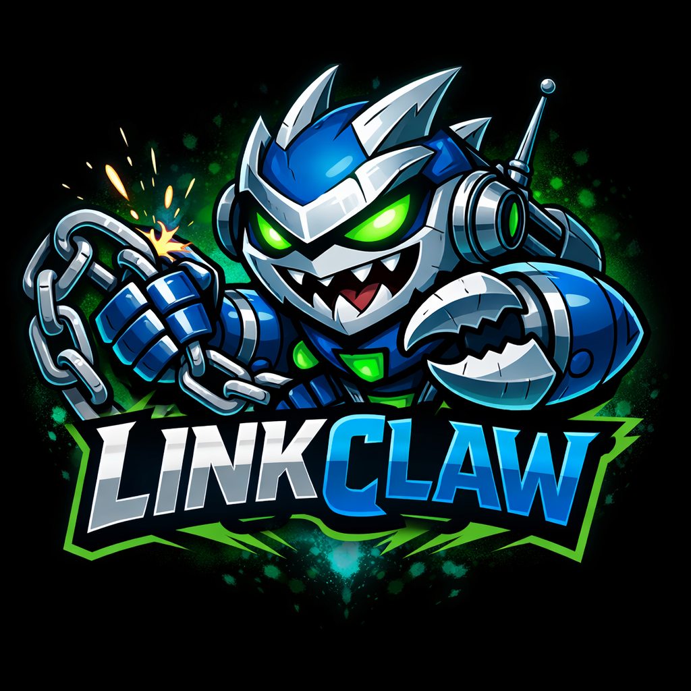
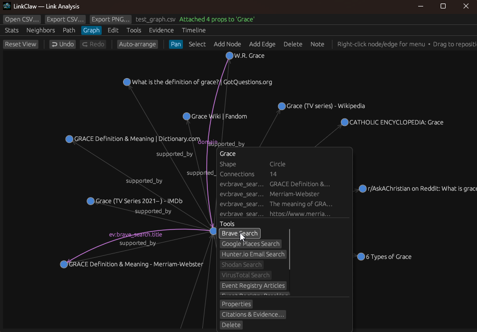

# LinkClaw

**Link-analysis for investigators, researchers, and anyone who needs to make sense of complex relationships.**

LinkClaw is a desktop graph workspace that combines interactive network visualization with structured research tools — evidence tracking, citation pins, API integrations, confidence scoring, and a timeline — all persisted in a single portable CSV.



---
## Screenshot

---

## What it does

You build a graph of people, places, organisations, events, or anything else. You connect them with labelled edges. You attach evidence to nodes and relationships, run tools against external APIs, score your confidence, and trace everything back to sources. Then you export it — the whole thing, including attachments and evidence, in one file.

---

## Features

### Interactive Graph Canvas

Six interaction modes accessible from the toolbar:

| Mode | What it does |
|------|-------------|
| **Pan** | Navigate, drag nodes, right-click for context menus |
| **Select** | Lasso-drag multi-select; Ctrl/Shift+click to extend |
| **Add Node** | Click empty canvas to create a node |
| **Add Edge** | Click source → destination to draw a link |
| **Delete** | Click nodes or edges to remove them |
| **Note** | Drop sticky notes anywhere on the canvas |

Nodes come in three shapes (Circle, Square, Diamond), can have custom icons or uploaded images, and carry arbitrary key-value properties. Edge labels appear at zoom ≥ 0.3×. Everything you see on the canvas is saved.

### Evidence & Citations

Every node and every edge can be backed by evidence. Open the right-click menu on anything and choose **Citations & Evidence** to attach sources.

Each evidence item records:
- Source URL and title
- Text snippet
- Captured date and observed date (used by Timeline)
- Tool name (auto-filled when evidence comes from an API run)
- Notes and tags
- Your confidence score (0 – 100%)

**Citation pins** link evidence to specific nodes or edges, with optional highlight text. Pinned citations show a 🔖 badge on canvas edges so you can see at a glance what is and isn't sourced.

### Confidence Scoring

Set a confidence score on any node or edge. Enable the **Conf** filter in the graph toolbar and dial in a threshold — edges below the threshold turn red so you can spot weak links immediately. Node confidence appears as a percentage label below the node shape when you zoom in.

System confidence is automatically hinted from citation density (more pins = higher hint), giving you a starting point before you form your own judgement.

### Timeline

The **Timeline** tab arranges all your evidence entries in chronological order. Set a date range to focus on a window of activity. Click any row to jump to the relevant node on the graph canvas.

### Attachments

Attach files directly to nodes — documents, screenshots, images, anything. Images are displayed on the node itself in the canvas. Every attachment is base64-encoded into the CSV when you save, so the file travels with the graph. Load the CSV on a different machine and all your attachments are there.

- Thumbnail preview in the node dialog
- Full preview dialog with metadata
- Open in your system viewer
- Rename and delete with confirmation
- First image uploaded auto-sets as the node image

### Tools — HTTP API Integration

Build reusable API tools with templated URLs, headers, query parameters, and JSON output mapping. Run them against any node to pull live data from external sources.

Pre-built templates included:

- **Brave Search** — web search
- **Shodan** — host and device search
- **VirusTotal** — file hash and URL analysis
- **Hunter.io** — email discovery
- **NewsAPI** — news by keyword
- **Google Places** — location data
- **Event Registry** — breaking events
- **Currents** — news feed

**Running a tool from a node:** right-click any node → Run Tool. Map inputs to node properties automatically, manually, or via templates. Results come back as a table. From there you can:

- Add results directly as new nodes and edges in the graph
- Attach results as evidence on the source node
- View the raw JSON response

API keys live in the **Secrets** sub-tab and are referenced in tool templates as `{{secret:name}}`. An **Audit Log** records every tool execution with timestamp, node, and status.

### Bulk Operations

Select multiple nodes with lasso or Ctrl+click, then apply a shape, set properties, or adjust confidence across all of them in one action. Full clipboard support: Copy, Cut, Paste, Duplicate.

### Undo / Redo

50-level undo stack covering every state change — node creation, edge edits, property updates, evidence pins, confidence changes, note moves, everything. Ctrl+Z / Ctrl+Y.

### Stats, Neighbors & Path

- **Stats** — node and edge counts at a glance
- **Neighbors** — find every node within N hops of a subject
- **Path** — shortest path between any two nodes

### Import & Export

**Open CSV** loads a graph. **Export CSV** saves the full state — graph structure, node positions, shapes, properties, sticky notes, evidence, citations, confidence scores, and all attachments encoded inline. **Export PNG** renders a 2400×2400 snapshot of the canvas.

CSV row types: `N` (nodes), `E` (edges), `P` (properties), `A` (notes), `V` (evidence), `C` (citations), `X` (edge confidence), `B` (attachments with base64 blobs).

---

## Keyboard Shortcuts

| Shortcut | Action |
|----------|--------|
| `Ctrl+Z` | Undo |
| `Ctrl+Y` | Redo |
| `Ctrl+A` | Select all nodes |
| `Ctrl+C` | Copy selected |
| `Ctrl+X` | Cut selected |
| `Ctrl+V` | Paste |
| `Ctrl+D` | Duplicate selected |
| `Delete` | Delete selected nodes |
| `Esc` | Deselect all |

---

## Building

Requires Rust (stable). Clone and run:

```
cargo build --release
```

The binary is self-contained. Config and secrets are stored in `%APPDATA%\linkclaw` on Windows or `~/.config/linkclaw` elsewhere.

---

## Tech

- **Rust** — single binary, no runtime dependencies
- **eframe / egui 0.29** — immediate-mode GUI
- **petgraph** — graph data structure and algorithms
- **reqwest + tokio** — async HTTP for tool execution
- **image** — thumbnail generation and PNG export
- **csv + serde** — serialisation

---

*LinkClaw — pull the thread.*
